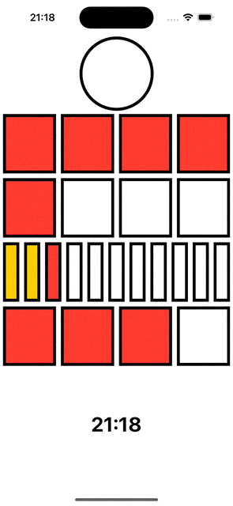

# Berlin Clock
An example of a Berlin Clock, developed entirely natively using Swift and SwiftUI.

✅ The app consists out of one screen:
- ✅ Even seconds make the top circle highlight. Uneven seconds will clear the circle.
- ✅ The first row is divided into 4 five hour blocks
- ✅ The second row is divided into 4 one hour blocks
- ✅ The third row is divided into 11 five minute blocks
- ✅ The fourth row is divided into 4 one minute blocks
- ✅ At the bottom we see a string representation of the current time

## Installation
The project does not require additional installation, as no dependency manager is currently used.

## Build
No additional setup is needed. Build project using Xcode.

## Technologies
* Swift
* SwiftUI

## Versions
* Xcode 15.1 (latest)
* Swift 5.9.0 (latest)